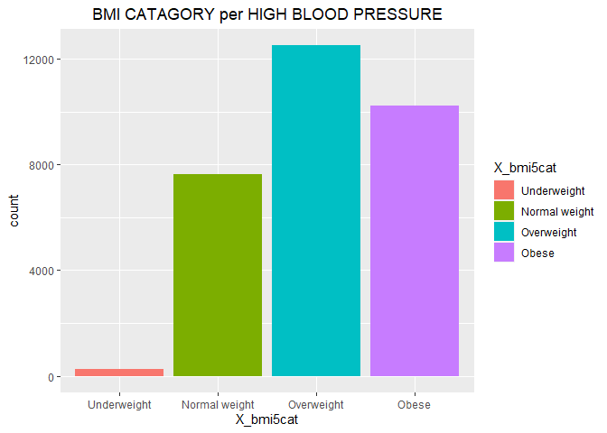
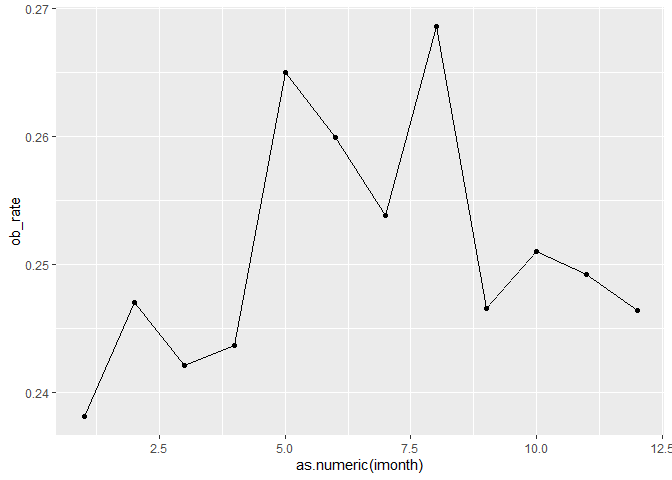
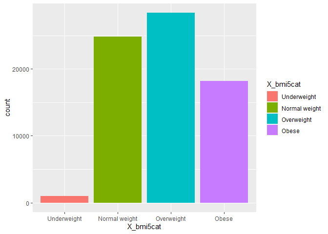
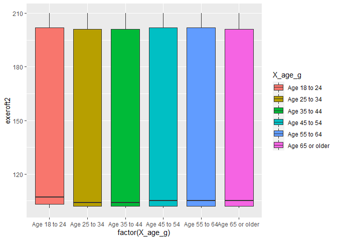

Exploring the BRFSS data
================

## Setup

### Load packages

``` r
library(ggplot2)
library(dplyr)
```

### Load data

``` r
load("C:/Users/rudym/OneDrive/Desktop/Data Analysis/Epidemic of Obesity/brfss2013.rdata")
```

``` r
data<-brfss2013%>%select(genhlth,cvdcrhd4,X_bmi5,X_bmi5cat,bphigh4,toldhi2,cvdstrk3,educa,strength,smoke100,alcday5,exerany2,X_ageg5yr,exeroft2,imonth,iday, iyear, X_age_g, smokday2)

str(data)
```

    ## 'data.frame':    491775 obs. of  19 variables:
    ##  $ genhlth  : Factor w/ 5 levels "Excellent","Very good",..: 4 3 3 2 3 2 4 3 1 3 ...
    ##  $ cvdcrhd4 : Factor w/ 2 levels "Yes","No": NA 2 2 2 2 2 2 1 2 2 ...
    ##  $ X_bmi5   : int  3916 1822 2746 2197 3594 3986 2070 NA 3017 2829 ...
    ##  $ X_bmi5cat: Factor w/ 4 levels "Underweight",..: 4 1 3 2 4 4 2 NA 4 3 ...
    ##  $ bphigh4  : Factor w/ 4 levels "Yes","Yes, but female told only during pregnancy",..: 1 3 3 3 1 1 1 1 3 3 ...
    ##  $ toldhi2  : Factor w/ 2 levels "Yes","No": 1 2 2 1 2 1 2 1 1 2 ...
    ##  $ cvdstrk3 : Factor w/ 2 levels "Yes","No": 2 2 2 2 2 2 2 2 2 2 ...
    ##  $ educa    : Factor w/ 6 levels "Never attended school or only kindergarten",..: 6 5 6 4 6 6 4 5 6 4 ...
    ##  $ strength : int  0 0 0 0 0 0 205 0 102 0 ...
    ##  $ smoke100 : Factor w/ 2 levels "Yes","No": 1 2 1 2 1 2 1 1 2 2 ...
    ##  $ alcday5  : int  201 0 220 208 210 0 201 202 101 0 ...
    ##  $ exerany2 : Factor w/ 2 levels "Yes","No": 2 1 2 1 2 1 1 1 1 1 ...
    ##  $ X_ageg5yr: Factor w/ 13 levels "Age 18 to 24",..: 9 7 8 9 10 6 4 9 7 10 ...
    ##  $ exeroft2 : int  NA 101 NA NA NA 102 NA NA NA 101 ...
    ##  $ imonth   : Factor w/ 12 levels "January","February",..: 1 1 1 1 2 3 3 3 4 4 ...
    ##  $ iday     : Factor w/ 31 levels "1","2","3","4",..: 9 19 19 11 6 27 22 4 24 24 ...
    ##  $ iyear    : Factor w/ 2 levels "2013","2014": 1 1 1 1 1 1 1 1 1 1 ...
    ##  $ X_age_g  : Factor w/ 6 levels "Age 18 to 24",..: 5 4 5 5 6 4 3 5 4 6 ...
    ##  $ smokday2 : Factor w/ 3 levels "Every day","Some days",..: 3 NA 2 NA 3 NA 3 1 NA NA ...

``` r
na_vec<-which(!complete.cases(data))
data<-data[-na_vec,]
str(data)
```

    ## 'data.frame':    72399 obs. of  19 variables:
    ##  $ genhlth  : Factor w/ 5 levels "Excellent","Very good",..: 3 2 2 1 3 1 2 5 1 5 ...
    ##  $ cvdcrhd4 : Factor w/ 2 levels "Yes","No": 2 2 2 2 2 2 2 2 2 1 ...
    ##  $ X_bmi5   : int  2487 3090 3206 3100 2912 2509 2496 3656 1984 2506 ...
    ##  $ X_bmi5cat: Factor w/ 4 levels "Underweight",..: 2 4 4 4 3 3 2 4 2 3 ...
    ##  $ bphigh4  : Factor w/ 4 levels "Yes","Yes, but female told only during pregnancy",..: 3 1 3 3 1 3 3 1 3 1 ...
    ##  $ toldhi2  : Factor w/ 2 levels "Yes","No": 2 2 1 1 1 1 1 1 2 1 ...
    ##  $ cvdstrk3 : Factor w/ 2 levels "Yes","No": 1 2 2 2 2 2 2 2 2 2 ...
    ##  $ educa    : Factor w/ 6 levels "Never attended school or only kindergarten",..: 6 6 6 5 4 6 5 5 6 4 ...
    ##  $ strength : int  203 103 0 0 0 0 0 0 103 103 ...
    ##  $ smoke100 : Factor w/ 2 levels "Yes","No": 1 1 1 1 1 1 1 1 1 1 ...
    ##  $ alcday5  : int  202 0 204 204 201 0 215 0 101 107 ...
    ##  $ exerany2 : Factor w/ 2 levels "Yes","No": 1 1 1 1 1 1 1 1 1 1 ...
    ##  $ X_ageg5yr: Factor w/ 13 levels "Age 18 to 24",..: 9 11 5 7 11 6 9 9 11 11 ...
    ##  $ exeroft2 : int  103 103 203 103 203 203 205 103 104 103 ...
    ##  $ imonth   : Factor w/ 12 levels "January","February",..: 5 6 6 7 11 6 7 11 1 1 ...
    ##  $ iday     : Factor w/ 31 levels "1","2","3","4",..: 7 20 27 29 5 24 13 22 8 3 ...
    ##  $ iyear    : Factor w/ 2 levels "2013","2014": 1 1 1 1 1 1 1 1 1 1 ...
    ##  $ X_age_g  : Factor w/ 6 levels "Age 18 to 24",..: 5 6 3 4 6 4 5 5 6 6 ...
    ##  $ smokday2 : Factor w/ 3 levels "Every day","Some days",..: 2 3 3 1 3 3 3 3 3 3 ...

``` r
attach(data)
```

-----

## Part 1: Data

The Behavioral Risk Factor Surveillance System (BRFSS) data is a
telephone survey in the U.S. and all U.S. territories. The data
collection method is uniform and random. The goal of this survey is to
collect data on preventative health factors and risky behavior that have
been linked to injuries, chronic illness, and disease. This would be a
generalized analysis to link many factors that affect a person’s health.
This is an observational study conducted by the BRFSS.

-----

## Part 2: Research questions

Authors Hammond and Levine analyze the types of economic costs
associated with obesity. They describe 4 types of costs that impact the
economy linked to obesity. These are medical, transportation,
productivity, and human capital. They specifically link five types of
diseases to obesity including stroke, hypertension,
hypercholesterolemia, coronary heart disease, and diabetes. I want to
analyze these five links listed in their’ analyses.

**Research quesion 1:** Given the listed diseases associated with
obesity, which disease has the highest correlations with obesity?

**Research quesion 2:** What is the average of obesity per month? How
does month to month rates compare?

**Research quesion 3:** How do individuals who exercise compare in the
BMI category? What about individuals who smoke and are in the obese
category? \* \* \*

## Part 3: Exploratory data analysis

**Research quesion 1:**

``` r
 high<- data %>% 
 select(X_bmi5cat,cvdcrhd4,cvdstrk3,bphigh4,toldhi2, iyear, imonth)
```

``` r
high<-high %>% 
 mutate(obese=ifelse(X_bmi5cat=="Obese",1,0)) %>%
  mutate(heart_disease=ifelse(cvdcrhd4=="Yes",1,0)) %>%
  mutate(stroke=ifelse(cvdstrk3=="Yes",1,0))  %>%
  mutate(bp=ifelse(bphigh4=="Yes",1,0)) %>%
  mutate(cho=ifelse(toldhi2=="Yes",1,0))
```

``` r
corr<-round(cor(high[,8:12]),2)
corr
```

    ##               obese heart_disease stroke   bp  cho
    ## obese          1.00          0.05   0.02 0.16 0.08
    ## heart_disease  0.05          1.00   0.14 0.18 0.17
    ## stroke         0.02          0.14   1.00 0.12 0.09
    ## bp             0.16          0.18   0.12 1.00 0.28
    ## cho            0.08          0.17   0.09 0.28 1.00

Here we can see that individuals with High Blood Pressure have the
highest correlation with obesity. High Cholesterol has the highest
correlation with high blood pressure.

``` r
c_plot <-high %>%
  filter(bphigh4=="Yes") %>%
  group_by(X_bmi5cat) 
  
  
ggplot(c_plot, aes(x=X_bmi5cat, fill=X_bmi5cat))+
  geom_bar()+ggtitle("BMI CATAGORY per HIGH BLOOD PRESSURE")+theme(plot.title=element_text(hjust=0.5))
```

<!-- -->

We can see that there are more who are overweight compared to obese that
have been diagnosed with high blood pressure.

**Research quesion 2:**

``` r
high_ob<-high %>%
  select(obese, imonth) %>%
  group_by(imonth) %>%
  summarise(ob_rate=sum(obese)/n()) 
            

  ggplot(data=high_ob, aes(x=as.numeric(imonth), y=ob_rate))+
  geom_point() +
    geom_line()
```

<!-- -->

Here we can see there are spikes during the summertime. There is a turn
around in the summer followed by an increase than a decrease in the
fall. One last spike around November and then a decrease in December.

**Research quesion 3:**

``` r
high<- high %>%
  mutate(exer=ifelse(exerany2=="Yes",1,0))
```

``` r
high_ex<-data %>%
  select(exerany2,X_bmi5cat) %>%
  group_by(X_bmi5cat,exerany2) %>%
  summarise(count=n())
```

``` r
ggplot(data=high_ex)+ 
  geom_bar(mapping=aes(x=X_bmi5cat,y=count, fill=X_bmi5cat), stat="identity")
```

<!-- -->

Here we see that individuals who are obese do participate in walking,
jogging, and running outside of work. We also see that underweight
individuals have the lowest count for physical activity outside of work.

``` r
smoke_d<- data %>%
 select(X_bmi5cat,exeroft2,smokday2,X_age_g)%>%
  filter(X_bmi5cat=="Obese", smokday2=="Every day",exeroft2<=210)%>%
  group_by(X_age_g)
```

``` r
ggplot(data=smoke_d, aes(x=factor(X_age_g), y=exeroft2, fill=X_age_g))+
 geom_boxplot()
```

<!-- -->

These plots show that the age range for walking, jogging, and running
have a median close to 110 times per week. These are individuals who
smoke every day and are considered obese.
